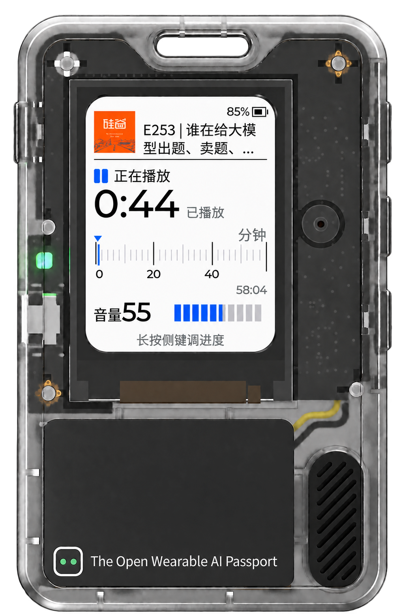
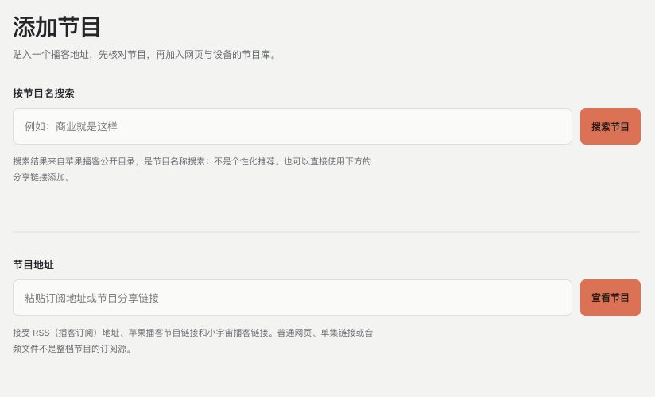
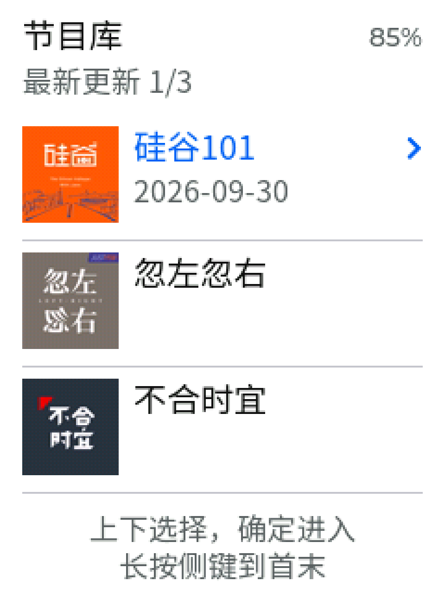
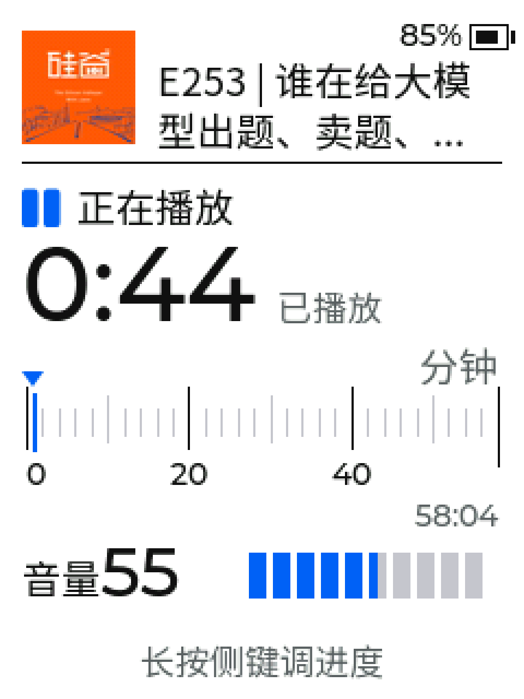

**简体中文** · [English（英文）](README.en.md)

# 随身听

给 AI Passport（人工智能护照）做的一套播客玩法。把节目管理留在网页，把收听交给这张小卡片上的三个按键。

在网页里准备好节目，拿起护照，选一集，按播放。听到一半停了，下次还能接着听。

[下载安装包](https://github.com/xiixiixixi/ai-passport-podcast/releases) · [安装与配对](docs/install.zh_CN.md) · [使用说明](docs/use.zh_CN.md) · [官方玩法页](https://ai-passport.folotoy.cn/plays/1024/)

  

外观与界面预览，图中播放数值用于展示。

## 先在网页里把节目准备好

知道节目名字，就搜节目；有 RSS（节目订阅源）、苹果播客节目链接或小宇宙公开免费节目链接，也可以直接粘贴添加。

后台默认提前准备每档节目的最新三集。哪些单集已经就绪、用了多少空间，都能在网页里看；自动缓存几集、旧内容保留多少，也可以自己调整。第一次听还没缓存的单集，需要等整集准备完成。

小宇宙公开页面能取得的历史单集可能不完整，有官方订阅源时优先使用它。

## 到了护照上，就用三个按键

列表里，上下选节目或单集，按确定进入。播放时，确定键暂停或继续，上下键调音量。想倒回刚才那句话，长按方向键进入进度调整，短按移动十五秒，长按移动一分钟，再按确定。

<table>
  <tr>
    <th>节目库</th>
    <th>播放页</th>
  </tr>
  <tr>
    <td></td>
    <td></td>
  </tr>
</table>

屏幕上留了封面、标题、大号已播时间、刻度尺和音量。默认十五秒无操作息屏，声音继续；第一次按键先唤醒，再按才操作。睡眠定时可以选十五、三十或六十分钟，到点暂停并停止接播。

## 暂停之后，还能接着听

比如在网页上听了一半，暂停后换到已配对的护照，就能从最近收听里继续那一集。网页和设备共用自家后台里的收听进度，每户也可以配对多台护照。

**这是设备程序与自家后台一起工作的玩法。缓存保存在后台电脑或家庭服务器上，收听时后台必须保持运行，护照也要能通过无线网络访问到它。设备目前没有离线音频缓存。**

## 想试的话，从这里开始

1. **先核对设备。**公开预览版面向 ESP32-C3（设备芯片）、八兆字节存储、已初始化兼容永久恢复系统的设备。旧布局或恢复功能不明的设备，先看[安装与兼容说明](docs/install.zh_CN.md)。
2. **启动后台。**在电脑或家庭服务器上安装并启动 Docker（后台运行工具）。从发布页下载 `installation.zip`（完整安装包）并解压；苹果电脑双击 `install.command`（安装入口），其他系统按安装说明运行对应脚本，再设置管理口令。
3. **安装设备程序。**按安装说明选择适合自己设备的方法，安装后会替换当前玩法。首次安装和保留资料的升级分别操作；安装包不包含永久恢复程序，也不提供旧设备身份迁移。
4. **配对。**登录后台，在「我的设备」生成六位配对码。手机连接护照显示的设置热点，按屏幕提示打开设置页，填写家里的 2.4 吉赫兹无线网络、后台局域网地址和配对码。连接及配对成功后进入节目库。

当前仍是公开预览版，首次安装、手机设置、配对、恢复和实际收听还需要进一步实机验收，续航没有实测数字。图中画面用于展示界面，具体进展见[检查记录](docs/validation.zh_CN.md)和[恢复兼容说明](firmware/docs/podcast-recovery.zh_CN.md)。

## 代码和说明

仓库同时包含 `firmware/`（设备程序）与 `server/`（网页和后台程序）；安装、升级和公开包工具放在 `scripts/`（工具目录）。

应用代码采用 MIT（宽松开源许可），依赖许可和图片来源见[第三方说明](docs/third-party.zh_CN.md)。公开文件清单和提交检查会排除私人配置、设备凭据、收听记录、音频缓存及内部材料，详见[公开提交说明](docs/publish.zh_CN.md)。
