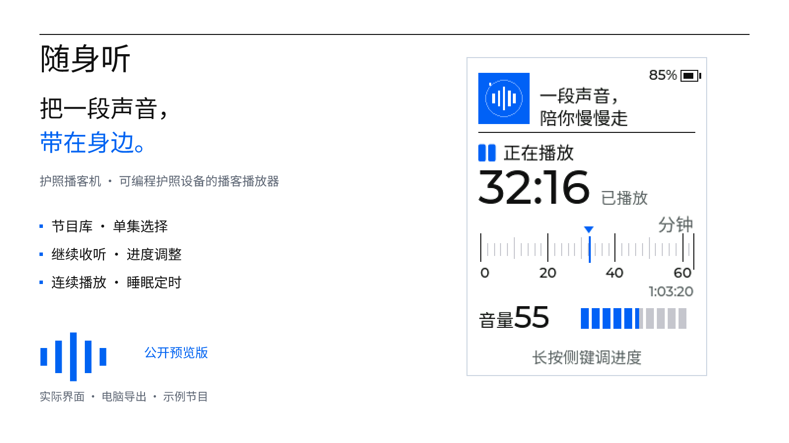
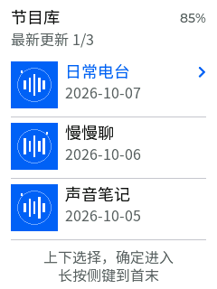

**简体中文** · [English（英文）](README.md)

# 随身听

把 AI Passport（AI护照）变成三键播客播放器。选节目、听一集，暂停之后接着听；用自家后台管理订阅、音频缓存和收听进度。

[下载安装包](https://github.com/xiixiixixi/ai-passport-podcast/releases) · [安装与配对](docs/install.zh_CN.md) · [使用说明](docs/use.zh_CN.md)

## 打开就能看懂的播放页

白底蓝色的刻度尺、大号已播时间和直观音量格，让一段声音的进度一眼可见。节目库按更新时间排列，选中节目后进入单集列表；最近收听可以继续播放。

| 播放页 | 节目库 |
| --- | --- |
|  |  |

图片由同一套实际界面程序在电脑上导出，使用虚构示例节目和原创封面；它们展示界面布局，不是设备照片或真实收听记录。

## 日常可以做什么

- 暂停续播、音量调整、按15秒或60秒调整进度。
- 按选定方向连续播放下一集，设置15／30／60分钟睡眠定时。
- 保存最近收听位置，让网页与已配对的设备接力收听。
- 在网页搜索或粘贴链接添加节目，管理自己的订阅和设备。
- 默认预先缓存每档最新3集；查看缓存占用，调整预缓存数量和清理保留数量。
- 无操作时息屏，声音继续；按键先唤醒，再进行操作。

## 先准备自己的后台

这是「硬件程序 + 自家后台」的组合。每户安装一个后台，可授权多台设备，共享这一户的节目和进度；收听时后台电脑或家庭服务器需要保持开机。

1. 在电脑或家庭服务器安装并启动 Docker（容器运行工具）。
2. 从发布页下载并解压安装包。苹果电脑双击 `install.command`（安装入口）；其他系统按[安装说明](docs/install.zh_CN.md)执行对应脚本。
3. 打开首次设置页，设置管理口令，在「我的设备」生成六位配对码。
4. 安装兼容的固件后，手机连接设备显示的设置热点，填写自己的无线网络、后台地址和配对码。
5. 连接及配对成功后进入节目库；以后开机即可收听。

设备通过2.4 GHz（吉赫兹）无线网络访问后台，后台地址填写自己的局域网地址。公开源码默认要求网页登录和设备配对，不含作者家庭的免密码补丁。

## 安装前看一下兼容范围

公开预览版面向 ESP32-C3（设备芯片）、8兆字节存储、已初始化现代永久恢复系统的设备。旧布局或恢复程序未知的设备，请先读[安装说明](docs/install.zh_CN.md)和[恢复兼容说明](firmware/docs/podcast-recovery.zh_CN.md)，不要直接写完整固件。

发布页同时提供完整固件与应用升级文件。完整固件从零地址安装；应用文件只能按升级工具指定位置写入。安装包不包含永久恢复程序，也不提供旧设备身份迁移。首次安装及新配对流程仍需进一步实机验收，详见[检查记录](docs/validation.zh_CN.md)。

## 给开发者

| 目录 | 内容 |
| --- | --- |
| `firmware/`（硬件源码） | 播放器、设备支持、字库与测试 |
| `server/`（后台源码） | 网页、节目源、缓存和设备授权 |
| `scripts/`（安装工具） | 后台安装、安全升级和公开包导出 |
| `assets/publication/`（展示素材） | 原创封面、真实界面程序导出图与可复现工具 |
| `docs/`（说明） | 安装、使用、检查与许可边界 |

应用代码采用 MIT（宽松开源许可），保留原板级支持许可、开放字体与图标声明。[第三方材料说明](docs/third-party.zh_CN.md)列出具体来源。公开包不包含家庭配置、设备凭据、二维码、收听记录、音频缓存、内部修复日志或未确认许可的节目封面原图。
